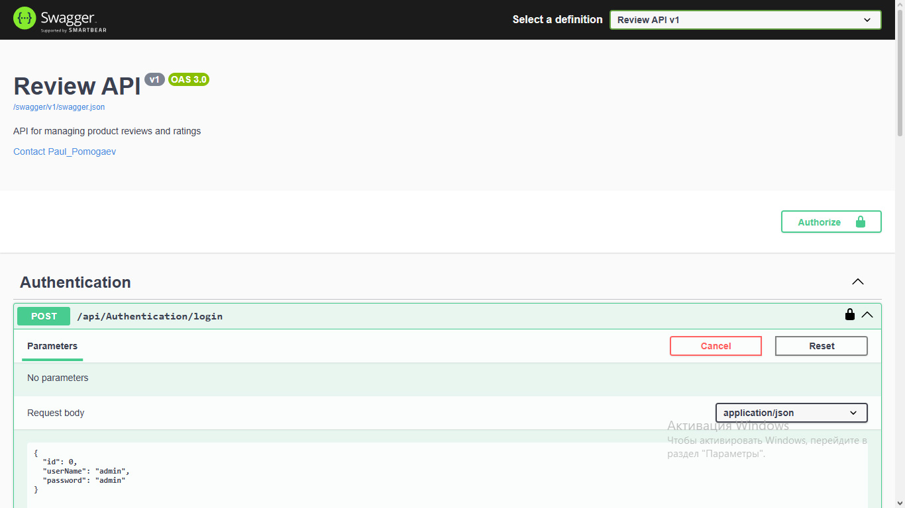

## 🛒 Reviews Microservice — Микросервис отзывов для интернет-магазина

<div align="center">
  
  <br>
  <sub>Учебный микросервис для управления отзывами и рейтингами товаров</sub>
</div>

---

## 📂 Содержание
- [О проекте](#--о-проекте)
- [Архитектура репозитория](#-архитектура-репозитория)
- [Ключевые возможности](#-ключевые-возможности)
- [Технологический стек](#-технологический-стек)
- [Архитектурные решения и примеры кода](#-архитектурные-решения-и-примеры-кода)
- [Демонстрация API](#-демонстрация-api)
- [Запуск проекта](#-запуск-проекта)
- [Контакты](#-контакты)

---

## 🏛️ О проекте

<div align="center">
  <sub><i>Для HR: кратко и по делу</i></sub>
</div>

**Reviews Microservice** — это учебный микросервис, разработанный для курса по ASP.NET Core. Он предоставляет REST API для управления отзывами и рейтингами товаров. Микросервис полностью независим, использует собственную базу данных и JWT-аутентификацию, что демонстрирует понимание микросервисной архитектуры, безопасности и современных подходов к разработке веб-приложений.

<div align="center">
  <sub><i>Для техлидов и разработчиков: технические детали</i></sub>
</div>

Проект построен на чистом ASP.NET Core Web API с разделением на два основных слоя:
- **Review.Domain** — содержит модели данных, бизнес-логику (сервисы), контекст базы данных и миграции Entity Framework Core.
- **ReviewsWebApplication** — слой представления (контроллеры), конфигурация (JWT, Swagger), точка входа в приложение.

## 📂 Архитектура репозитория

```text
📁 Reviews
├── 📁 Review.Domain
│   ├── 📁 Abstractions          # IReviewService, ILoginService
│   ├── 📁 Helper                 # Initialization (заполнение БД тестовыми данными)
│   ├── 📁 Migrations             # Миграции EF Core
│   ├── 📁 Models                 # Сущности (Review, Login, Status и DTO)
│   ├── 📁 Services                # ReviewService, LoginService
│   └── 📄 DataBaseContext.cs      # Контекст БД
└── 📁 ReviewsWebApplication
    ├── 📁 Configuration           # JwtSettings
    ├── 📁 Controllers             # AuthenticationController, ProductController, ReviewController
    ├── 📄 appsettings.json        # Строка подключения, настройки JWT
    └── 📄 Program.cs               # Точка входа, регистрация сервисов, Swagger
```
## 💡 Ключевые возможности

### 📝 Управление отзывами (CRUD с мягким удалением)
- Получение списка всех отзывов или отзывов по конкретному товару.
- Получение детальной информации об отзыве по ID.
- Добавление нового отзыва (только для авторизованных пользователей).
- Мягкое удаление отзыва — отзыв помечается статусом `Deleted`, но остаётся в базе.

**Пример кода (мягкое удаление):**
```csharp
public async Task<bool> DeleteAsync(int reviewId, string deletedBy = "system", string? reason = null)
{
    var review = await _databaseContext.Reviews.FirstOrDefaultAsync(r => r.Id == reviewId);
    if (review == null) return false;

    review.Status = Status.Deleted;
    review.DeletedAt = DateTime.UtcNow;
    review.DeletedBy = deletedBy;
    review.DeleteReason = reason;

    await _databaseContext.SaveChangesAsync();
    return true;
}
```

### ⭐ Рейтинг товаров
- Автоматический расчёт среднего рейтинга на основе оценок пользователей.
- Получение рейтинга для одного товара или для нескольких товаров одновременно (оптимизированный запрос).
- Подсчёт общего количества отзывов по товару.

**Пример кода (расчёт рейтинга для нескольких товаров):**
```csharp
public async Task<List<ProductRatingDtoWithId>> GetProductRatingsByProductIdsAsync(List<int> productIds)
{
    var result = await _databaseContext.Reviews
        .Where(r => r.Status == Status.Actual && productIds.Contains(r.ProductId))
        .GroupBy(r => r.ProductId)
        .Select(g => new ProductRatingDtoWithId
        {
            ProductId = g.Key,
            Rating = Math.Round(g.Average(r => (double)r.Grade), 2),
            ReviewCount = g.Count()
        })
        .ToListAsync();

    var missingIds = productIds.Except(result.Select(x => x.ProductId)).ToList();
    result.AddRange(missingIds.Select(id => new ProductRatingDtoWithId
    {
        ProductId = id,
        Rating = 0,
        ReviewCount = 0
    }));

    return result.OrderBy(x => productIds.IndexOf(x.ProductId)).ToList();
}
```

### 🔐 Аутентификация и авторизация (JWT)
- Простая модель пользователей (таблица `Logins` с логином и паролем).
- Эндпоинт `/api/Authentication/login` для получения JWT-токена.
- Защищённые эндпоинты требуют передачи токена в заголовке `Authorization: Bearer <token>`.
- Токен настраивается через `JwtSettings` (аудитория, издатель, секретный ключ).

**Пример кода (генерация токена):**
```csharp
[HttpPost("login")]
public IActionResult Login([FromBody] Login user)
{
    var result = _loginService.CheckLogin(user);
    if (result)
    {
        var secretKey = new SymmetricSecurityKey(Encoding.UTF8.GetBytes(_jwtSettings.Secret));
        var signinCredentials = new SigningCredentials(secretKey, SecurityAlgorithms.HmacSha256);
        var tokeOptions = new JwtSecurityToken(
            issuer: _jwtSettings.ValidIssuer,
            audience: _jwtSettings.ValidAudience,
            claims: new List<Claim>(),
            expires: DateTime.Now.AddMinutes(6),
            signingCredentials: signinCredentials
        );
        var tokenString = new JwtSecurityTokenHandler().WriteToken(tokeOptions);
        return Ok(new JWTTokenResponse { Token = tokenString });
    }
    return Unauthorized();
}
```

## 🔧 Технологический стек
- **ASP.NET Core 8 Web API** (контроллеры, маршрутизация, middleware)
- **Entity Framework Core 8** (Code First, миграции)
- **SQL Server** (LocalDB / Express)
- **JWT-аутентификация** (Microsoft.AspNetCore.Authentication.JwtBearer)
- **Swagger / OpenAPI** (документация и тестирование API)
- **Сериализация JSON** (System.Text.Json)
- **Git / GitHub**

## 🧠 Архитектурные решения и примеры кода

### 1. Многослойная архитектура
Проект разделён на два основных слоя:
- **Review.Domain** — содержит модели, бизнес-логику (сервисы), контекст БД и миграции.
- **ReviewsWebApplication** — слой API (контроллеры, конфигурация, middleware).

Такое разделение обеспечивает слабую связанность и упрощает тестирование.

### 2. Мягкое удаление (Soft Delete)
Вместо физического удаления записей из базы данных используется статус `Deleted`. Это позволяет сохранять историю и восстанавливать данные при необходимости.

**Глобальный фильтр в контексте БД:**
```csharp
protected override void OnModelCreating(ModelBuilder modelBuilder)
{
    modelBuilder.Entity<Models.Review>()
        .HasQueryFilter(r => r.Status == Status.Actual);
}
```

### 3. JWT-аутентификация
Для защиты API используется JWT-токен. Простая модель пользователей хранится в таблице `Logins`. При успешной аутентификации выдаётся токен, который необходимо передавать в заголовке `Authorization: Bearer <token>` при запросах к защищённым эндпоинтам.

**Генерация токена (контроллер аутентификации):**
```csharp
[HttpPost("login")]
public IActionResult Login([FromBody] Login user)
{
    var result = _loginService.CheckLogin(user);
    if (result)
    {
        var secretKey = new SymmetricSecurityKey(Encoding.UTF8.GetBytes(_jwtSettings.Secret));
        var signinCredentials = new SigningCredentials(secretKey, SecurityAlgorithms.HmacSha256);
        var tokeOptions = new JwtSecurityToken(
            issuer: _jwtSettings.ValidIssuer,
            audience: _jwtSettings.ValidAudience,
            claims: new List<Claim>(),
            expires: DateTime.Now.AddMinutes(6),
            signingCredentials: signinCredentials
        );
        var tokenString = new JwtSecurityTokenHandler().WriteToken(tokeOptions);
        return Ok(new JWTTokenResponse { Token = tokenString });
    }
    return Unauthorized();
}
```

### 4. Оптимизация запросов рейтингов
Для эффективного получения рейтингов нескольких товаров одновременно используется группировка на стороне базы данных. Это позволяет избежать множественных запросов (проблема N+1).

**Метод получения рейтингов по списку ID товаров:**
```csharp
public async Task<List<ProductRatingDtoWithId>> GetProductRatingsByProductIdsAsync(List<int> productIds)
{
    var result = await _databaseContext.Reviews
        .Where(r => r.Status == Status.Actual && productIds.Contains(r.ProductId))
        .GroupBy(r => r.ProductId)
        .Select(g => new ProductRatingDtoWithId
        {
            ProductId = g.Key,
            Rating = Math.Round(g.Average(r => (double)r.Grade), 2),
            ReviewCount = g.Count()
        })
        .ToListAsync();

    // Добавляем товары без отзывов с рейтингом 0
    var missingIds = productIds.Except(result.Select(x => x.ProductId)).ToList();
    result.AddRange(missingIds.Select(id => new ProductRatingDtoWithId
    {
        ProductId = id,
        Rating = 0,
        ReviewCount = 0
    }));

    return result.OrderBy(x => productIds.IndexOf(x.ProductId)).ToList();
}
```

## 📸 Демонстрация API

### Основные эндпоинты

| Метод | URL | Описание | Доступ |
|-------|-----|----------|--------|
| `GET` | `/api/Review` | Получить все отзывы | Public |
| `GET` | `/api/Review/filter?productId={id}` | Получить отзывы по товару | Public |
| `GET` | `/api/Review/{id}` | Получить отзыв по ID | Public |
| `POST` | `/api/Review` | Добавить новый отзыв | JWT |
| `DELETE` | `/api/Review/{id}?reason=...` | Мягкое удаление отзыва | JWT |
| `GET` | `/api/Product/{productId}/rating` | Получить рейтинг товара | Public |
| `GET` | `/api/Product/ratings?ids=1,2,3` | Получить рейтинги нескольких товаров | Public |
| `POST` | `/api/Authentication/login` | Получить JWT-токен | Public |

### Примеры запросов

**Получение отзывов по товару:**
```bash
GET https://localhost:7274/api/Review/filter?productId=5
```

**Добавление нового отзыва (требуется токен):**
```bash
POST https://localhost:7274/api/Review
Authorization: Bearer <token>
Content-Type: application/json

{
  "productId": 5,
  "userId": 3,
  "text": "Отличный товар!",
  "grade": 5
}
```

**Получение рейтингов нескольких товаров:**
```bash
GET https://localhost:7274/api/Product/ratings?ids=1,2,3,4,5
```

**Ответ:**

```json
[
  { "productId": 1, "rating": 4.5, "reviewCount": 12 },
  { "productId": 2, "rating": 3.8, "reviewCount": 5 },
  { "productId": 3, "rating": 0, "reviewCount": 0 }
]
```
## 🚀 Запуск проекта

### Предварительные требования
- Установленный [.NET 8 SDK](https://dotnet.microsoft.com/download)
- SQL Server (LocalDB, Express или другая редакция)
- Git

### Установка и запуск

**Клонировать репозиторий:**
```bash
git clone https://github.com/PaulPomogaev/Reviews.git
cd Reviews
```

**Настроить строку подключения к БД** в `ReviewsWebApplication/appsettings.json`:
```json
"ConnectionStrings": {
  "Review_Database": "Server=.;Database=Review_Database;Integrated Security=true;TrustServerCertificate=true;"
}
```

**Применить миграции для создания базы данных:**
```bash
cd Review.Domain
dotnet ef database update --startup-project ../ReviewsWebApplication
```

**Запустить веб-приложение:**
```bash
cd ../ReviewsWebApplication
dotnet run
```
После успешного запуска откройте браузер и перейдите по адресу https://localhost:7274/swagger. Вы увидите документацию API (Swagger UI), где можно протестировать все эндпоинты.

## 📬 Контакты
- **Автор:** Paul Pomogaev
- **Email:** paulslock1@gmail.com
- **GitHub:** [@PaulPomogaev](https://github.com/PaulPomogaev)

## 🔑 Ключевые слова
ASP.NET Core | Web API | Entity Framework Core | JWT | Аутентификация | Микросервис | Отзывы | Рейтинг | C# | SQL Server | Swagger | REST API | Code First | Soft Delete
